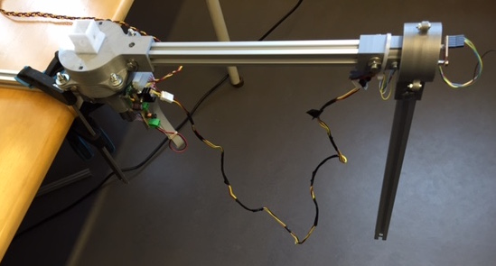

# Inverted Pendulum

To get the inverted pendulum application up and running, please do the following.

1. Connect one [motor joint](../../joints/dc-motor-joint) and a free-running [pendulum joint](../../joints/pendulum-joint) according to the picture below. 

2. Download and install the development environment ([see this page](../))

3. Open the project file applications/pendulum. Make sure that the project settings is correct and that you are using the right programmer (default is chipKITProgrammer).

4. Make sure that the supply voltage to the power is 24V. Reset the ChipKIT board and make sure that after the yellow LED is done blinking no LED should be lit up. If any of the leds are lit the following could be the issue:
..* Yellow LED stays lit: The I2C bus is hung up
..* Red LED stays lit: No connection to IMU found

5. Put the pendulum link in upright position. If the application works, the inverted pendulum should now stabilize. 

## Controller programming
A MATLAB script for generating control parameters are found [here](../../joints/dc-motor-joint/software/matlab) labeled "furuta_controller.m".