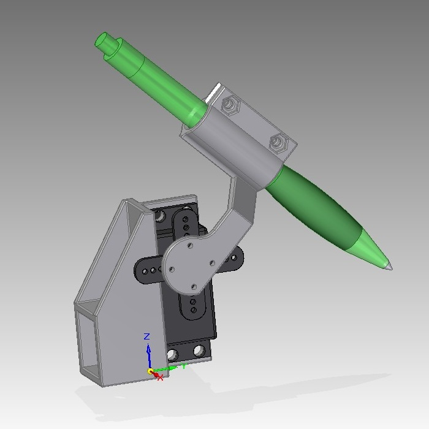
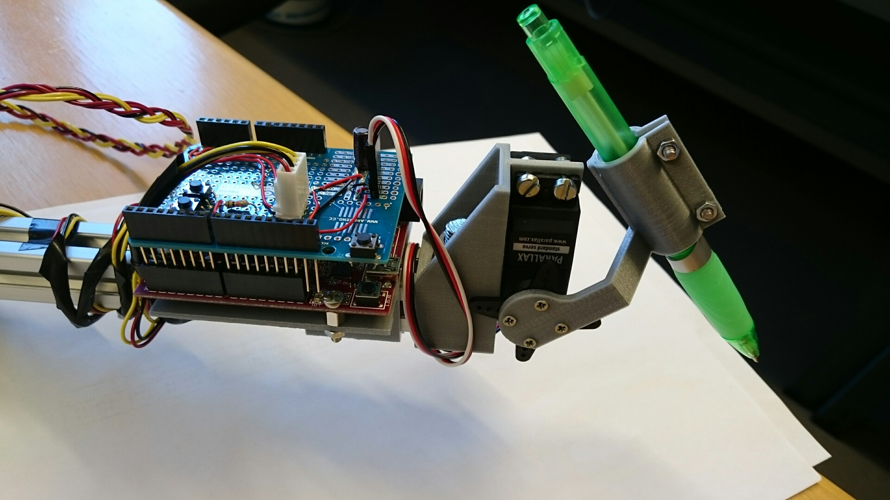

# A Pen End Effector
This is a simple pen end effector designed around a standardized servo. Designed for 3d-printing.

## Bill of Materials
* Standard servo
* Pen
* 4x M4 screws (10mm)
* 4x M4 nuts
* 2x M3 screws (10mm)
* 2x M3 nuts
* 4x M2 screws (6mm)

## Some Pictures

