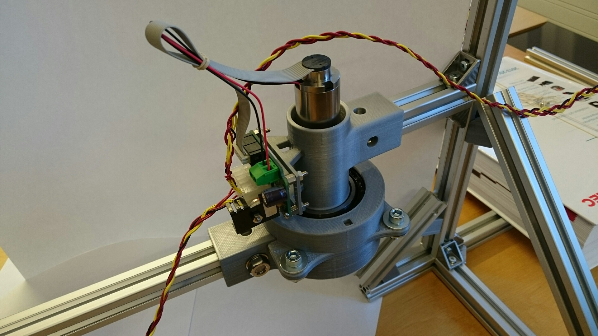
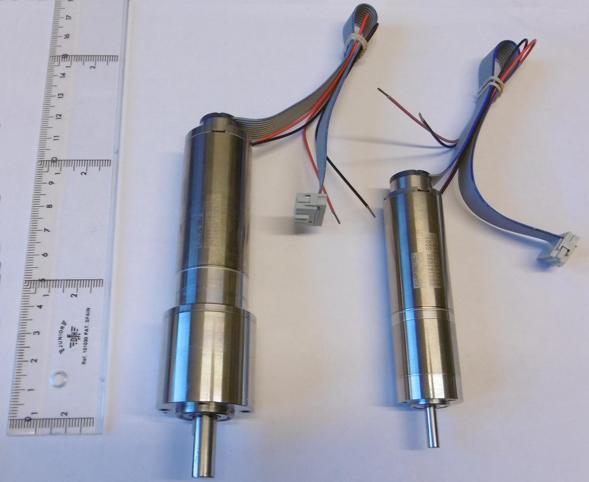

# DC-Motor Joints

These are joints designed around brushed dc-motors equipped with encoders. Each motor joint comes equipped with it's own electronics and software for controlling the motors and communication.

## Motors
The motors these joints are designed around comes from the DCX range of Maxon Motors.

(Link to configuration specifications or drawings for measurements). Two joints are then designed around each of these motors.

Technically any brushed dc-motor supplied with an encoder are possible to use but that requires redesign with new measurements of one of the existing joints.

## Hardware and Manufacturing
The hardware are located [here](./hardware) both as stl files as well as the source code.

The manufacturing process used to build the hardware is 3d-printing.

## Electronics
The design of the controlling electronics are located [here](./electronics). It is based on a pic24 microcontroller and a LMD1800 motor driver with connections to both motor and encoder.

It contains gerber files for pcb manufacturing, source files for eagle. It also contains source files for a uno32 power shield intended for use on a master controller.

## Software
The software for controlling the motors are located [here](./software). This includes source code for the pic24 microcontroller as well as MATLAB code used to derive controller parameters, extract parameters from the hardware used for modeling and system simulations.

## On-board LED Functionality
Each electronic board is equipped with two leds, one green and one red.

The possible blinking messages for the red led are:

| period | duty cycle | meaning |
| ---: | ---: | :--- |
| 1 sec | 20% | The encoder needs calibration |
| 3 sec | 50% | Error reading from the EEPROM data |
| &infin; sec | 100% | Motor controller is overheated | 

When none of these conditions above are present the red led will flash with a period the same as the current sampling rate of the controller and have a duty cycle equal to the cpu utilization of the timer interrupt.

The default mode of the green led is to blink each time it receives an I2C-message but can be changed to other modes in the source code.