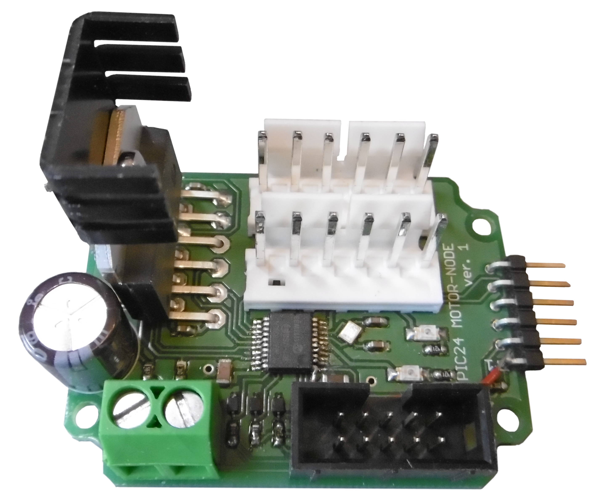
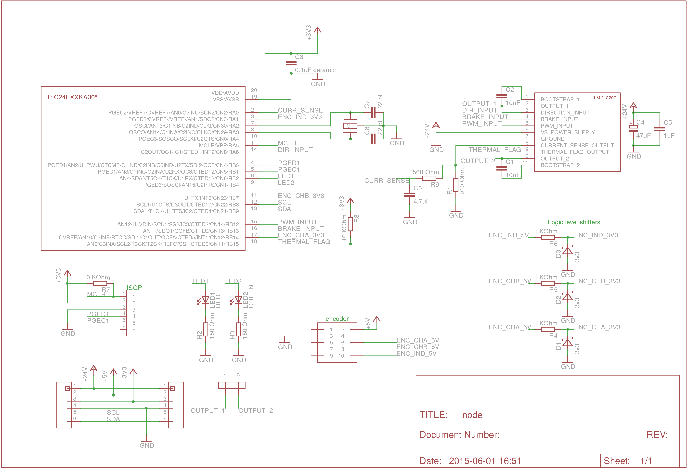
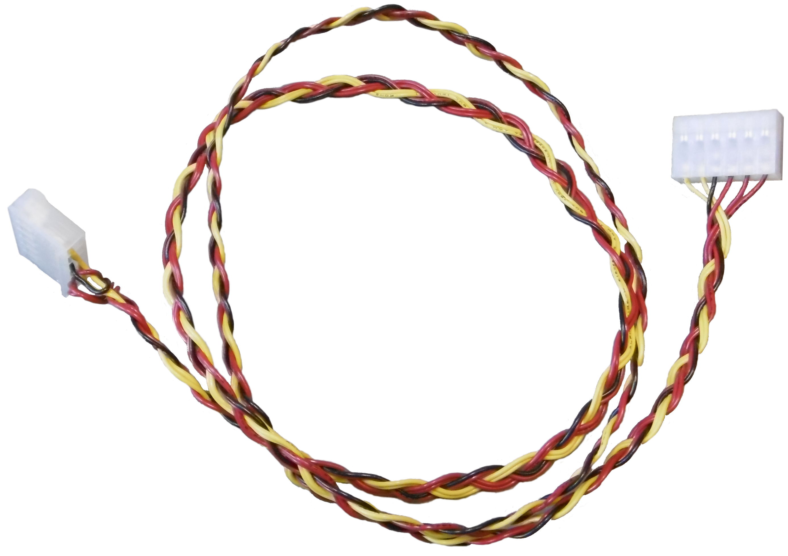

# The electronics
This part contains the electronics used:

A completed breadboard looks like:

## Schematic
The following is the schematic for the node:

## Bill of Material for Node
n | value | device | package
---: | :--- | :--- | :---
2x | 10nF | capacitor | C0603
1x | 0.1&mu;F ceramic | capacitor | C0805K
1x | 0.1&mu;F | capacitor | E5-10,5
1x | 1&mu;F | capacitor | C050-025X075
1x | 4.7&mu;F | capacitor | C0805K
2x | 22pF | capacitor | C0603
3x | 3v3 | zener diode | SOD-323 
1x | RED | LED | CHIPLED_1206
1x | GREEN | LED | CHIPLED_1206
1x | 910&Omega; | Resistor | R0603
2x | 150&Omega; | Resistor | R0603
3x | 1k&Omega; | Resistor | R0603
2x | 10k&Omega; | Resistor | R0603
1x | 560&Omega; | Resistor | R0603
1x | 32MHz | crystal | [SMD](https://www.elfa.se/en/quartz-smd-32-mhz-iqd-lfxtal052187r500/p/17451988)
1x | PIC24F32KA301 | &mu;C | SSOP-20
1x | LMD18200 | motor controller | TO-220-11
2x | MOLEX 3.96mm 6p | male connector | MOLEX_3.96MM_6P
1x | DIN41651 10P | encoder connector | DIN41651_10P
1x | 2x5.08P | screw block | 2x5.08P
1x | 6x1 pin header | pin header | 6X1P 2.54mm pin header

## Cables
The cabling between each node has a female 6 pin connector with 3.96mm raster in each end.

## Additional Electronics
Source files for a power shield for a uno32 master controller is also available. This is equipped with a input for 2x 4mm laboratory cables with two connections for cabling compatible with the joints.

An early version of an improved node board is also located here. This includes numerous improvements, such as using an LM339 voltage comparator to provide a more robust interface for reading the encoder. Another intended improvement is zoning which aims to isolate the motor driver from the rest of the circuit, which should reduce the electrical noise plaguing the current version.