# GPX22 joint
Joint designed around the Maxon GPX22 gearhead with a 22mm circumference

## The Joint
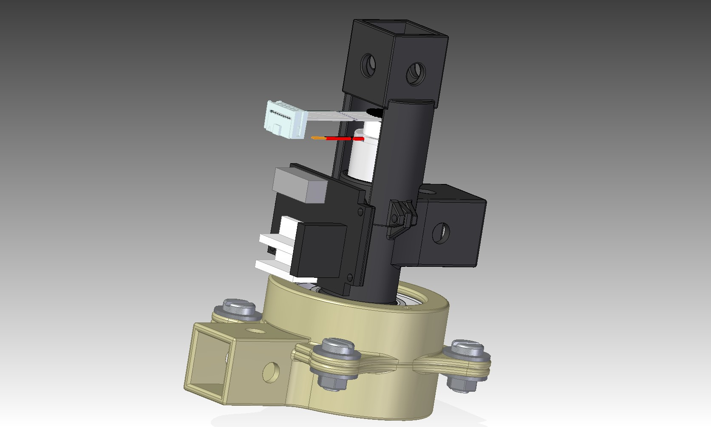
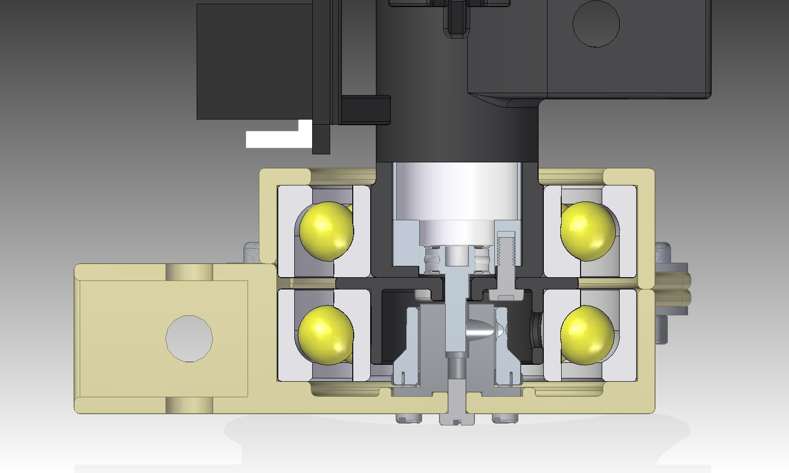

## Bill of materials
* DC-motor equipped with a Maxon GPX22 gearhead or similar dimensions
* 2x bearing of type SKF 7206 or equivalent
* HUB-06 universal wheel hub [(example)](http://www.electrokit.com/hub06-universellt-nav-4mm-par.44892)
* 5x M3 6mm screws
* 4x M3 8mm screws
* 2x M3 12mm screws
* 6x M3 bricks
* 6x M3 nuts
* 4x M3 spacer 5/5mm 
* 5x M2.5 nuts
* 5x M2.5 12mm screws
* 5x M2.5 bricks
* 8x M6 bricks
* 4x M6 15mm screws
* 4x M6 nuts
* Some glue (epoxy or superglue)

## 3D-printing guidelines
All of the parts have been successfully printed in PLA-plastic, which is preferable to ABS-plastic due to being more stiff. However, especially the high load bearing parts, can be printed in more robust plastic such as XT.

100% infill has been used on all parts in order to maximize strength bearing capability and minimize elasticity. Support is used everywhere and needs to be properly removed after the print is finished.

## Assembly
Assembling the joints is done the following way:
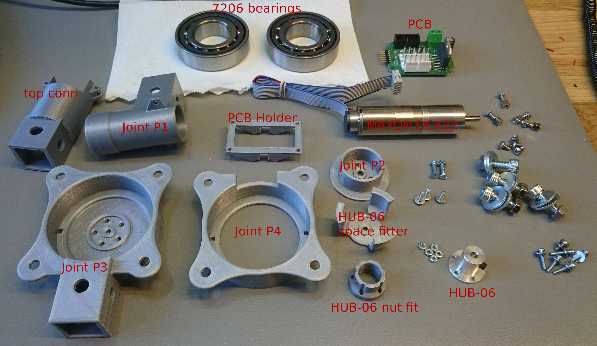

Glue the **PCB holder** onto **Joint P1** relatively high up. Make sure it's attached straight.
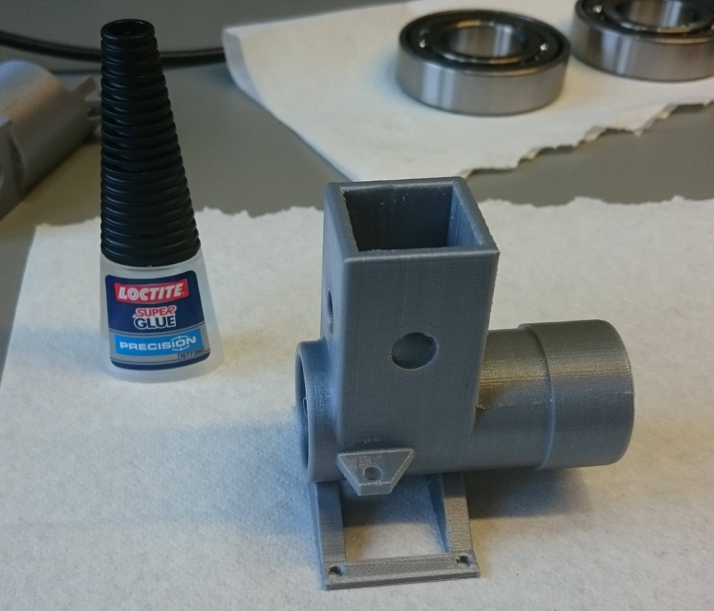

Put a bearing inside the **Joint P4** and put it on the **Joint P1** part. Insert the motor inside the **Joint P1** part and screw the **Joint P2** part onto the motor through **Joint P1** using **three 8mm M3** screws.
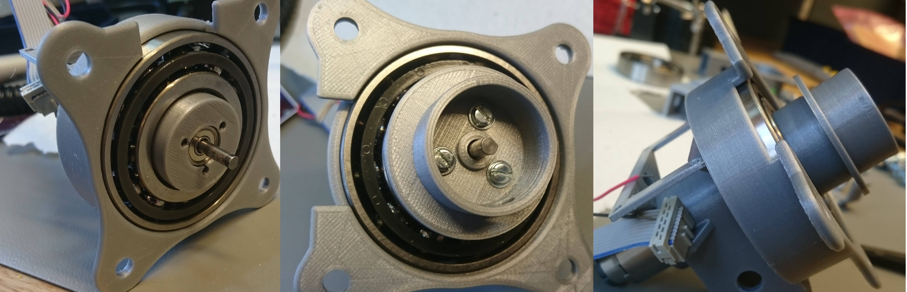

Put **five M2.5 nuts** into the **HUB-06 nut fit** and attach it to the **HUB-06** using the accompanied fastening screw.
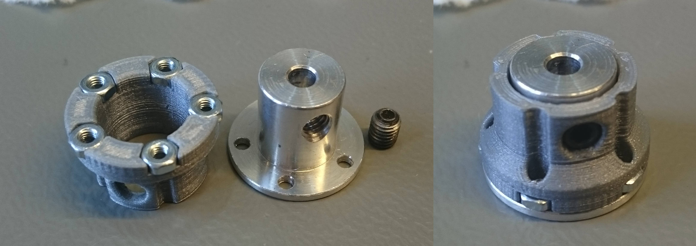

Put the **assembled HUB-06** into the **HUB-06 space-fitter** (for better fit, screw them together using a **6mm M3 screw** ). Push it onto the motor axis until it stops and tighten the screw onto the axis using a hex-key. When fastened remove the **HUB-06 space-fitter**.
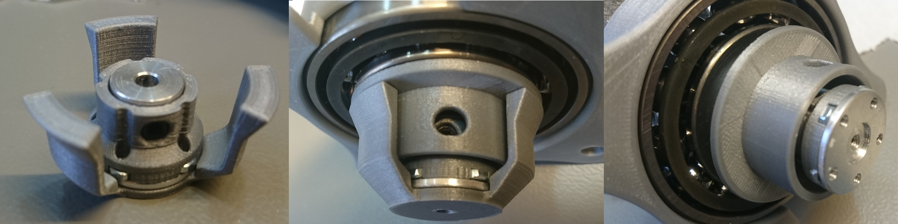

Put a bearing inside **Joint P3** and put it onto the assembly. Fasten the two parts using **five 12mm M2.5 screws** and **one 6mm M3 screw**. Rotate the lower part while tightening the screws in order to make sure its centered properly.
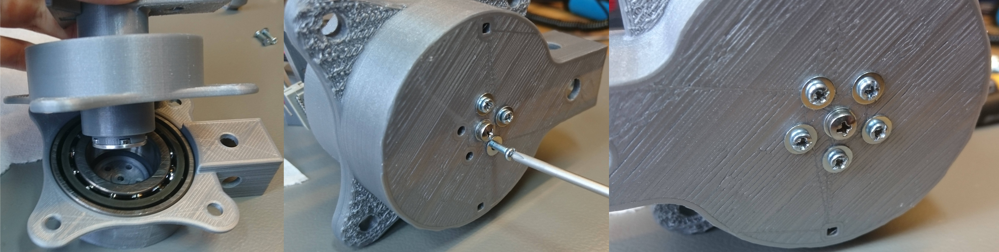

Screw the two parts together using **four 15mm M6 screws and nuts**.
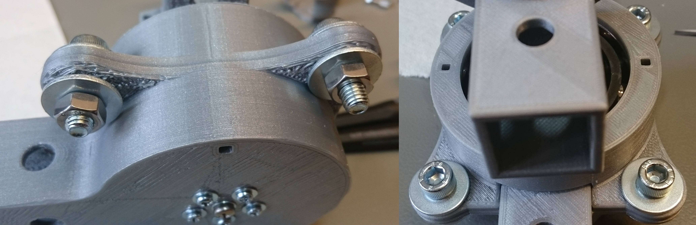

Fasten the PCB-board to the PCB-holder using **four 6mm M3 screws** unto **four 5mm M3 spacers** and connect the motor connections.
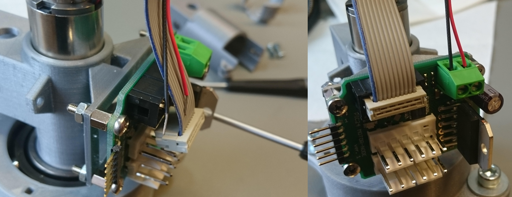

Put the **top connector** on the assembly and fasten it with **two 12mm M3 screws**.
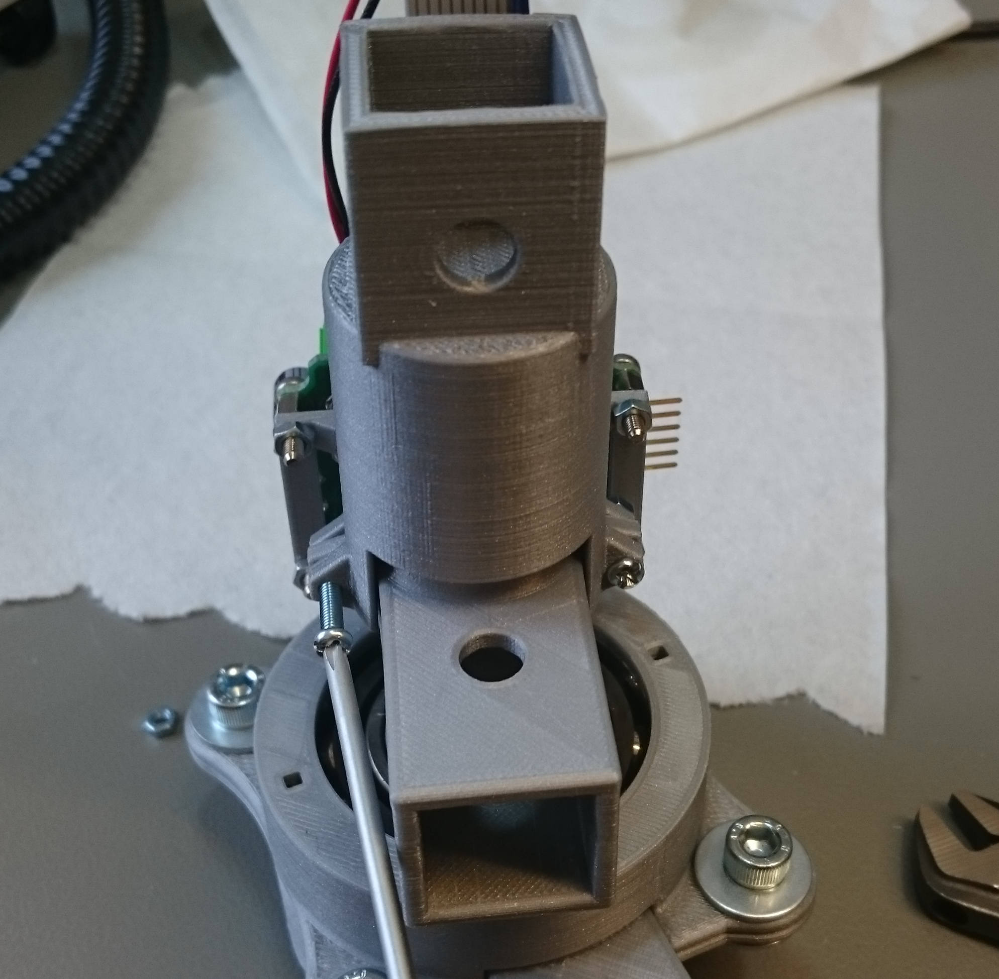

