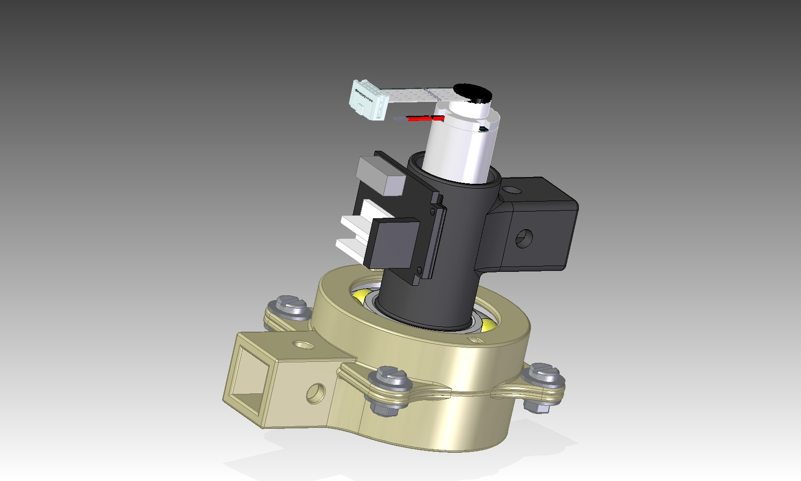
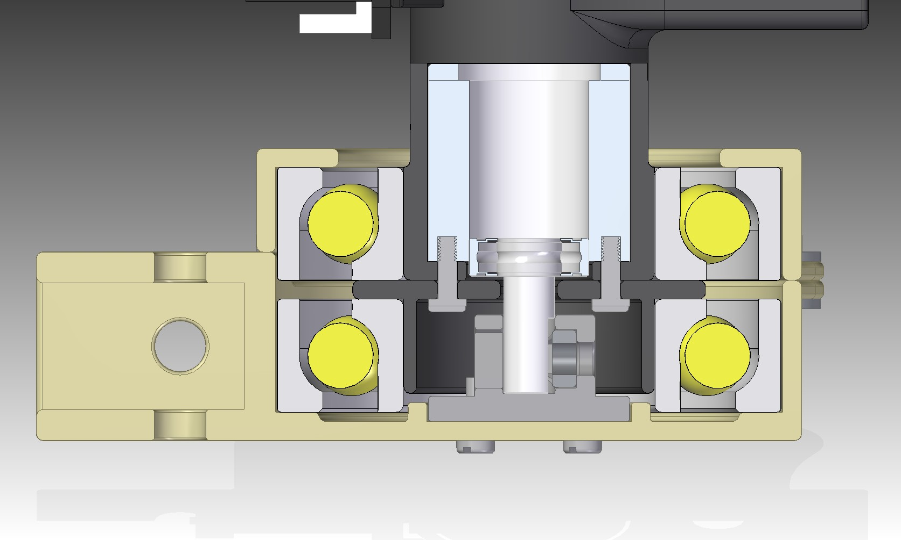
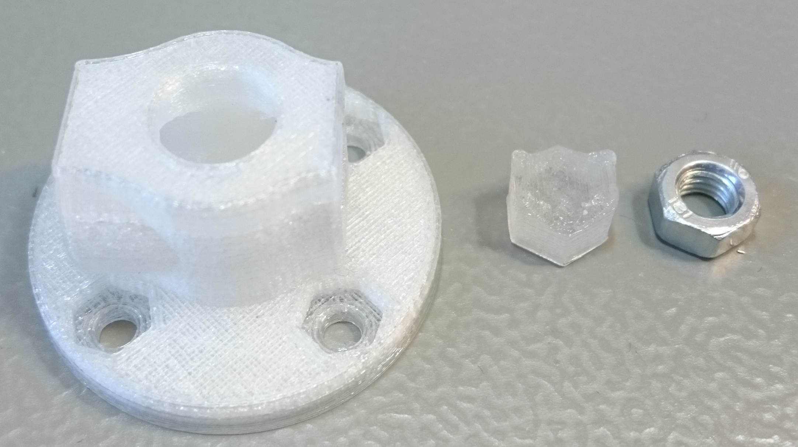
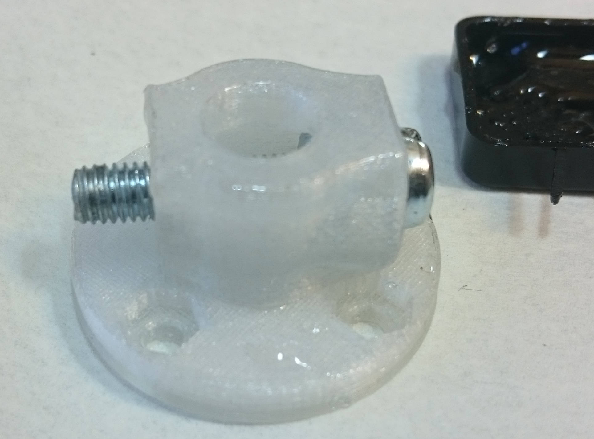
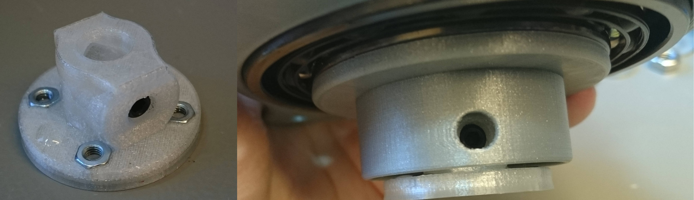
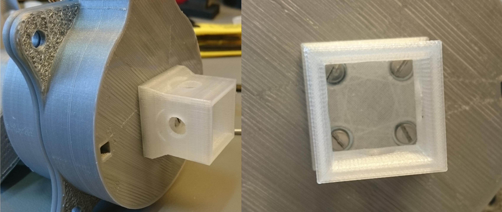

# GPX32 joint
Joint designed around the Maxon GPX32 gearhead with a 32mm circumference

## The Joint

## Bill of materials
* DC-motor equipped with a Maxon GPX32 gearhead or similar dimensions
* 2x bearing of type SKF 7208 or equivalent
* 8x 10mm M3 screws
* 4x M3 nuts
* 8x M3 bricks
* 4x M3 spacer 5/5mm 
* 8x M6 bricks
* 4x M6 15mm screws
* 4x M6 nuts
* 1x M5 nut
* Some glue (epoxy or superglue)

## 3D-printing guidelines
All of the parts have been successfully printed in PLA-plastic, which is preferable to ABS-plastic due to being more stiff. However, especially the high load bearing parts, can be printed in more robust plastic such as XT.

100% infill has been used on all parts in order to maximize strength bearing capability and minimize elasticity. Support is used everywhere and needs to be properly removed after the print is finished.

## Assembly
The assembly procedure is mostly the same as with the the [22mm joint](../22mm_joint) with a few differences.

One is that no metal connector for 8mm axis exists so one has to make their own **8mm-shaft-attach**.

An M5-nut should be inserted into the attacher and glued in place there to keep it in place. A screw can be used in order to make sure it's all the way in. The backside filler nut ( **8mm extra nut** ) should also be glued in place. In addition, in order to somewhat increase the attachers ability to take loads it can be covered in epoxy glue.

Insert **four M3-nuts** into the nut holders. If they fall out some small amount of glue can be applied just to keep them in place. An M5 tightening screw should also be inserted into the glued M5 nut, here an extra nut from the **HUB-06 wheel hub** is used but a general short M5 screw should do the trick.

This assembly is then pressed onto the motor shaft all the way and tightened onto it.

The entire underside is then screwed onto the shaft attacher similarly as the [22mm joint](../22mm_joint) using **four 10mm M3 screws**.

If an additional perpendicular attachment point is required an **32mm bottom connector** can be attached to the bottom by the same screws used to fasten the bottom to the shaft attacher.
