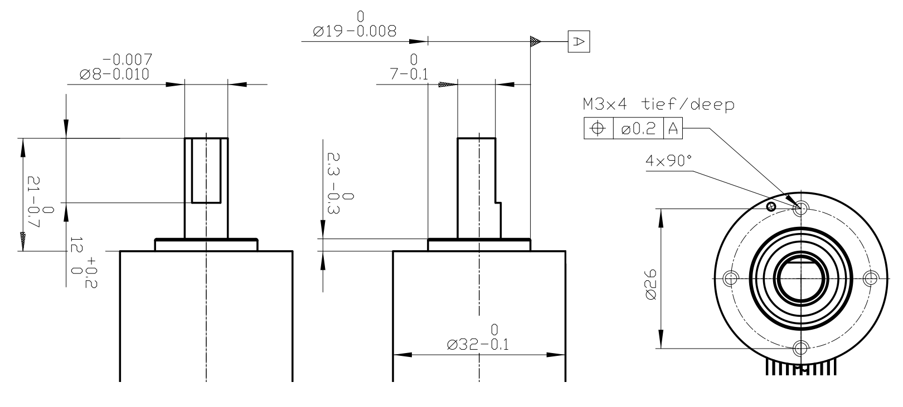

# DC-motor Joint Hardware
This contains designs for two different joints. One centered around a [22mm circumference gearbox](./22mm_joint) and one centered around a [32mm circumference gearbox](./32mm_joint).

[Misc](./misc) contains miscellaneous files used generally throughout the system.

[22mm_joint](./22mm_joint) contains a joint designed around a Maxon GPX22 gearhead which has the following dimensions:

[32mm_joint](./32mm_joint) contains a joint designed around a Maxon GPX32 gearhead which has the following dimensions:

