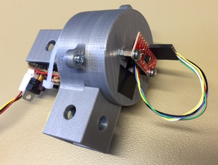
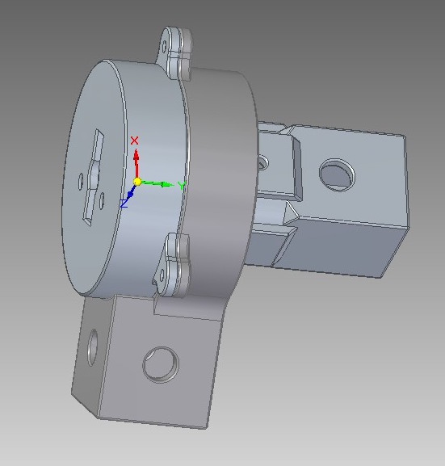

# Pendulum joint

The pendulum joint is a free-running joint, meaning that it cannot be
controlled. After it has been assembled, it can look like this:

The joint consists of four 3D printed parts, a bearing (SKF 6205), an MPU9150 (gyro and
accelerometer), and a slip ring (22mm). All 3D models are available as .stl-files and as source files in Solid Edge format.

The following figure shows the CAD file when it is assembled

and the following figure shows the exploded view of the parts
(excluding the slip ring).

